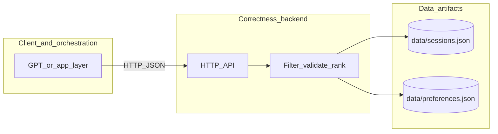
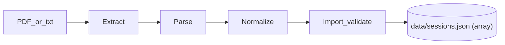
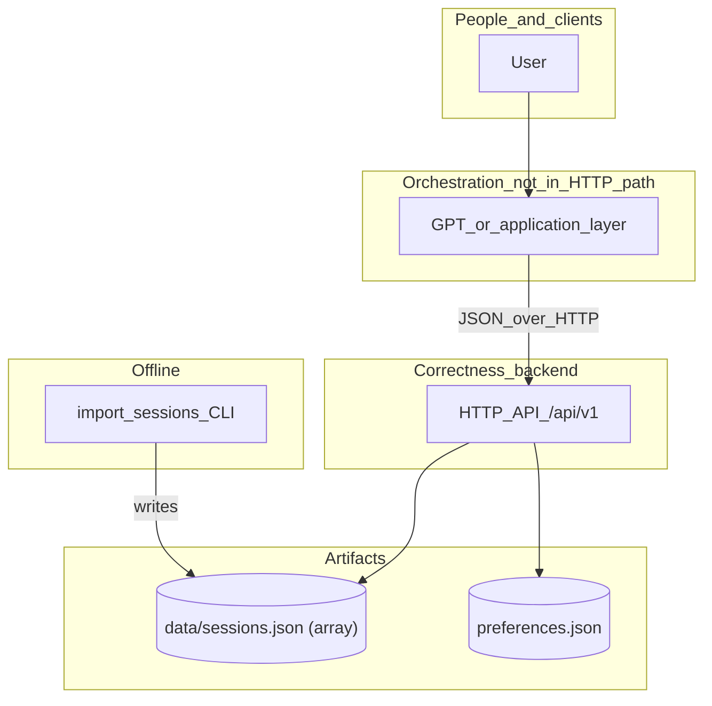
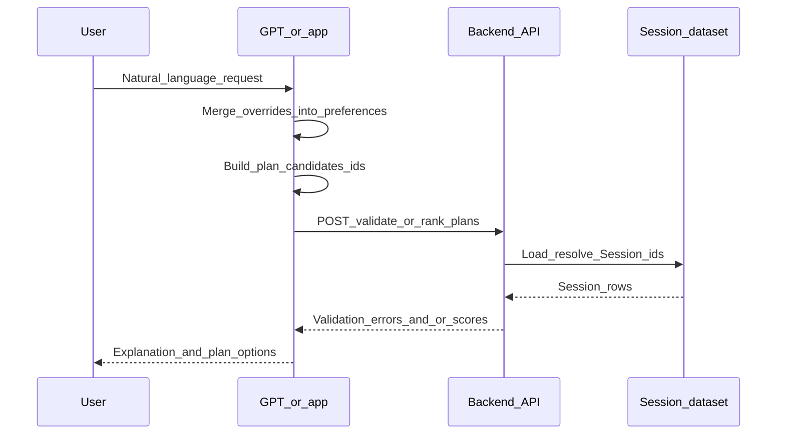
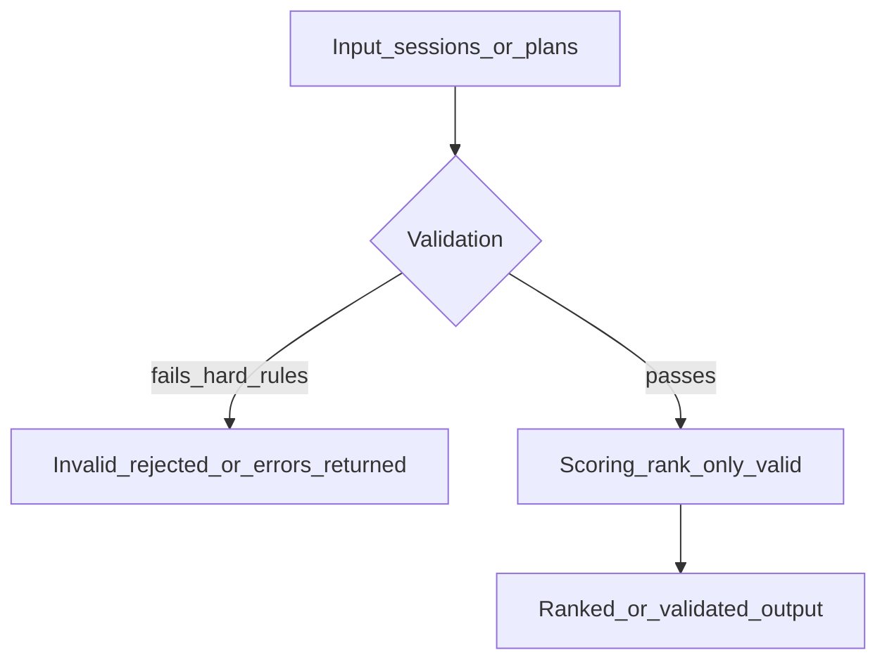

# Architecture and System Design

## 1. Purpose and audience

This document describes the **system architecture** for the Olympics Sessions Planner MVP. It ties together:

- [prd.md](prd.md) — product goals and boundaries
- [data-contract.md](data-contract.md) — canonical data shapes
- [scoring-and-validation-spec.md](scoring-and-validation-spec.md) — validation vs scoring rules
- [api-spec.md](api-spec.md) — HTTP correctness-layer API
- [importer-spec.md](importer-spec.md) — offline PDF/text ingestion

**Normative detail** lives in those documents. This file explains **how the pieces fit** and **who owns which concerns**.

---

## 2. System context

The product is a **conversational planner** over official LA28 session data. Three cooperating layers appear in almost every flow:

| Layer | Role |
|-------|------|
| **Conversational / presentation** | Interprets natural language, chooses planning shape (one-day, weekend, multi-day), merges overrides into effective preferences, assembles candidate plans, formats answers. Typically GPT plus a thin application shell. |
| **Correctness backend** | Deterministic session access, filtering, validation, ranking. No “generate my weekend” orchestration. |
| **Data** | Canonical session dataset (from import) and planner preferences (configured separately). |

**Out of scope for MVP** (see PRD): ticketing, live LA28 API sync, multi-user persistence, travel optimization.

---

## 3. Core architectural principles

These are non-negotiable across design and documentation:

1. **Real data only** — Plans reference sessions that exist in the imported dataset; no invented sessions.
2. **Separation of flexibility vs correctness** — Natural language, planning shape, and multi-step flows sit **above** the backend; the backend answers “what is valid?” and “what ranks higher?” deterministically.
3. **No backend planning orchestration** — No API such as `POST /generate-weekend-plan`. The backend exposes **get sessions**, **validate plan**, **rank sessions**, **rank plans** (see [api-spec.md](api-spec.md)).
4. **Validation ≠ scoring** — Invalid options are rejected or excluded; among valid options, scores order outcomes (see [scoring-and-validation-spec.md](scoring-and-validation-spec.md)).
5. **Single canonical contracts** — Runtime behavior is defined by [data-contract.md](data-contract.md); importer and API must not drift from it without updating that document.
6. **Specifications first** — Implementation is expected to converge to the docs in this repository, not the other way around.

---

## 4. Logical decomposition

### 4.1 Conversational / application layer (external to this repo’s core)

**Responsibilities:**

- Parse user intent (“best weekend”, “Saturdays only”, “avoid cricket”).
- Decide **plan type** (`one_day`, `two_day`, `multi_day`) and build **plan objects** matching [data-contract.md](data-contract.md) and [scoring-and-validation-spec.md](scoring-and-validation-spec.md).
- Merge conversational overrides into a **single effective `Preferences` object** per API call (no separate overrides field in MVP — see [api-spec.md](api-spec.md)).
- Call the backend to **list sessions**, **validate** candidate plans, **rank** sessions or plans.
- Present results and explanations to the user.

**Does not own:** hard rule enforcement logic or numeric scoring formulas (those are specified for the backend / shared libraries).

### 4.2 Correctness backend (in scope for this repository)

**Responsibilities:**

- Load and query the **canonical session dataset** (see §6).
- **Filter** sessions (e.g. GET with query parameters per [api-spec.md](api-spec.md)).
- **Validate** plans against sessions + preferences; return structured errors ([data-contract.md](data-contract.md), [scoring-and-validation-spec.md](scoring-and-validation-spec.md)).
- **Rank** sessions and plans using the MVP numeric model in [scoring-and-validation-spec.md](scoring-and-validation-spec.md); return score breakdowns for explainability.

**Does not own:** multi-step NL planning workflows, “best plan” search across all combinations unless the client enumerates candidates and asks for ranking.

### 4.3 Offline importer (separate command, same repo)

**Responsibilities:**

- PDF → text → parse → normalize → import-time validate → emit **JSON array** of sessions per [importer-spec.md](importer-spec.md).

**Does not run** in the request path of the HTTP API.

---

## 5. Data architecture

### 5.1 Artifacts

| Artifact | Role | Shape |
|----------|------|--------|
| **Sessions file** | Canonical schedule rows for runtime | JSON **array** of `Session` objects at root ([data-contract.md](data-contract.md) §15.2, [importer-spec.md](importer-spec.md) §15.1). Default path conceptually `data/sessions.json` (configurable via env such as `SESSIONS_FILE`). |
| **Preferences file** | User/system planner preferences | JSON `Preferences` with nested `rules` ([data-contract.md](data-contract.md) §9). Separate from sessions. |

### 5.2 Identity

- **`Session.id`** is the only key used inside **plans** and for resolution from the dataset ([data-contract.md](data-contract.md) §4, [api-spec.md](api-spec.md) §7).
- **`sessionCode`** is display/business metadata; resolution from code to `id` happens outside or at the edge of validation if ever exposed.
- Importer may set `id` to schedule code or a prefixed stable id ([data-contract.md](data-contract.md) §4.4, [importer-spec.md](importer-spec.md) §10.2).

### 5.3 Derived / importer-only fields

Fields such as `stage`, `zone`, `finalsHeavy` may appear in importer internals or optional debug output but are **not** part of the MVP runtime contract unless promoted in [data-contract.md](data-contract.md). MVP scoring must not depend on them ([scoring-and-validation-spec.md](scoring-and-validation-spec.md) §5.3).

---

## 6. Session dataset and API behavior

The backend holds a **canonical session dataset** loaded from the sessions file ([api-spec.md](api-spec.md) §7).

- **`GET /api/v1/sessions`** returns filtered rows from that dataset.
- **`POST /api/v1/validate`** and **`POST /api/v1/rank/plans`** resolve all `primarySessionId` and `alternateSessionIds` against that dataset; unknown IDs yield **validation errors in a 200 response** (e.g. `SESSION_NOT_FOUND`), not HTTP 404 ([api-spec.md](api-spec.md) §7, §15).
- **`POST /api/v1/rank/sessions`** accepts **full session objects** in the body; ranking does not require dataset lookup by id for scoring, but invalid rows may be dropped per spec ([api-spec.md](api-spec.md) §7, §12).

---

## 7. Validation and scoring (conceptual)

- **Session validation** — Eligibility: exists, allowed sport/day, required fields, date/day consistency ([scoring-and-validation-spec.md](scoring-and-validation-spec.md) §8).
- **Plan validation** — Shape, duplicates, cross-day sport rules when configured, alternates rules ([scoring-and-validation-spec.md](scoring-and-validation-spec.md) §9).
- **Scoring** — Only **valid** candidates are scored; numeric MVP model (session 0–40, plan 0–100) with documented components and tie-breakers ([scoring-and-validation-spec.md](scoring-and-validation-spec.md) §11–15).

The API returns **validation results** and **scoring results** in the shapes defined in [data-contract.md](data-contract.md) §13–14 and [api-spec.md](api-spec.md).

---

## 8. Import pipeline (offline)

High-level stages: **extract → parse → normalize → validate → emit** ([importer-spec.md](importer-spec.md) §6).

- **CLI** (normative): `import` and `import-text` subcommands with `-out` defaulting conceptually to `data/sessions.json` ([importer-spec.md](importer-spec.md) §8).
- Output is **not** mixed with preferences ([importer-spec.md](importer-spec.md) §15.2).

Recommended package layout: `cmd/import_sessions`, `internal/ingest/pdf`, `internal/ingest/transform`, `internal/ingest/pipeline` ([importer-spec.md](importer-spec.md) §7).

---

## 9. HTTP API surface (MVP)

Under `/api/v1` ([api-spec.md](api-spec.md)):

| Method | Path | Purpose |
|--------|------|---------|
| GET | `/health` | Liveness |
| GET | `/sessions` | Filtered session listing |
| POST | `/validate` | Plan validation only |
| POST | `/rank/sessions` | Rank supplied session rows |
| POST | `/rank/plans` | Validate + rank supplied plans |

Details, query-parameter mapping to the filter contract, error shapes, and status code policy are in [api-spec.md](api-spec.md).

---

## 10. Deployment and configuration (MVP)

- **Backend process** listens on a configurable port (e.g. `PORT`, default `8080` per [README](../README.md)).
- **Sessions** and **preferences** paths are configurable (e.g. `SESSIONS_FILE`, `PREFERENCES_FILE`).
- **Authentication** — out of scope for MVP ([api-spec.md](api-spec.md) §5).
- **Importer** runs as a separate CLI invocation (CI, laptop, or job); not required for every API deploy if sessions file is pre-generated.

---

## 11. Observability and quality

- **Determinism** — Same inputs and preferences should yield the same validation and ranking results ([api-spec.md](api-spec.md) §2.3, scoring spec).
- **Explainability** — Scoring responses include **component breakdowns** where specified ([data-contract.md](data-contract.md) §14).
- **Testing** — Planner, API integration, e2e, and importer tests are described in the respective specs and [importer-spec.md](importer-spec.md) §18.

---

## 12. Evolution and extension points

Documented open areas include: pagination for GET sessions, richer convenience scoring, promoting derived fields into the runtime contract, alternate ranking behavior, and importer layout versioning ([api-spec.md](api-spec.md) §19, [importer-spec.md](importer-spec.md) §20, [data-contract.md](data-contract.md) §18).

Changes should update the **relevant normative doc first**, then implementation.

---

## 13. Document map

| Document | Contents |
|----------|----------|
| [prd.md](prd.md) | Vision, MVP scope, product principles |
| [data-contract.md](data-contract.md) | Session, Preferences, Plan, filters, validation/scoring result shapes |
| [scoring-and-validation-spec.md](scoring-and-validation-spec.md) | Rules, MVP numeric model, tie-breakers, plan types |
| [api-spec.md](api-spec.md) | HTTP endpoints, dataset resolution, errors |
| [importer-spec.md](importer-spec.md) | PDF/text import pipeline, emitted file format, CLI |
| **architecture.md** (this file) | System structure and cross-cutting view |
| [diagrams/implementation-plan-deployable-chunks.md](diagrams/implementation-plan-deployable-chunks.md) | Chunked implementation order and definition of done |
| [test-plan.md](test-plan.md) | Test layers, traceability to specs, fixtures, CI expectations |
| [diagrams/README.md](diagrams/README.md) | Mermaid sources and export notes |

---

## 14. Diagrams

The following diagrams are **Mermaid** (render on GitHub, in many IDEs, and in Cursor). Standalone sources: [diagrams/system-context.mmd](diagrams/system-context.mmd), [diagrams/planning-sequence.mmd](diagrams/planning-sequence.mmd), [diagrams/validation-vs-scoring.mmd](diagrams/validation-vs-scoring.mmd); see [diagrams/README.md](diagrams/README.md) for export notes.

### 14.1 System context (containers)

Who talks to what at runtime versus offline import.

### 14.2 Planning flow (sequence)

Typical pattern: orchestration builds candidate **plans** and preferences, then asks the backend to **validate** and/or **rank**—it does not call a “generate plan” orchestration endpoint.

### 14.3 Validation vs scoring (conceptual)

Hard gates first; soft scores only among valid options.

---

## 15. Summary

The Olympics Sessions Planner MVP is a **three-part system**: conversational orchestration (external), a **thin deterministic backend** for sessions, validation, and ranking, and **offline import** that produces canonical session JSON. **Specifications define behavior**; this architecture document describes how those specifications compose into a coherent system.
